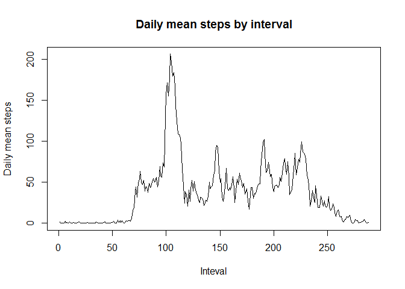
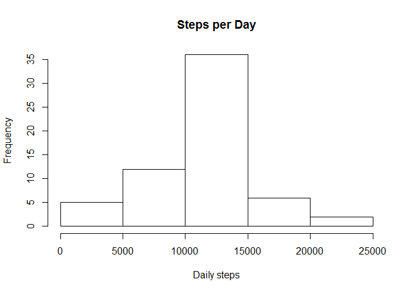
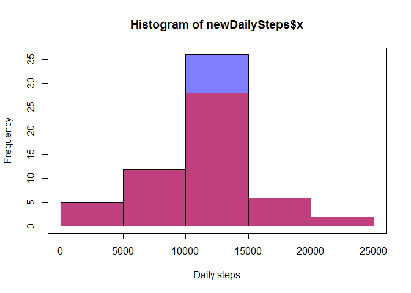
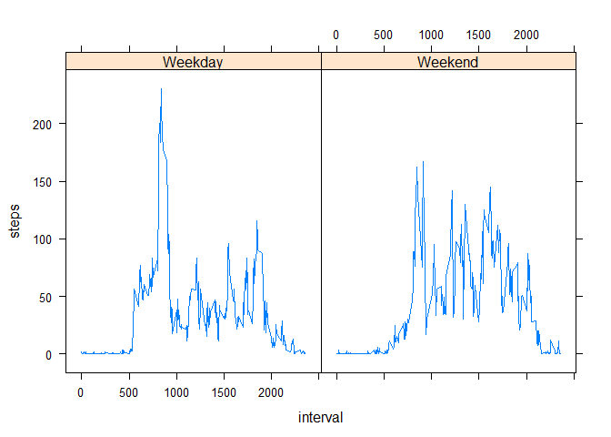

# Reproducible Research: Peer Assessment 1


##Load data and pre-process

```r
library(utils)
d = read.table('./activity/activity.csv', sep = ",", header = T)
d$date = as.Date(d$date)
```

##Steps taken per day

Produce a histogram of number of steps taken each day

```r
dailySteps = aggregate(d$steps, by =list(d$date), FUN = sum)
hist(dailySteps$x, breaks = 5, xlab = "Daily steps", main = 'Steps per Day')
```

<!-- -->

Mean steps taken per day:

```r
print(mean(dailySteps$x, na.rm = T))
```

```
## [1] 10766.19
```

Median steps taken per day:

```r
print(median(dailySteps$x, na.rm = T))
```

```
## [1] 10765
```


##Daily activity pattern

Line plot of average steps taken per 5-minute inteval, averages across all days


```r
intervalAvgSteps = aggregate(d$steps, list(d$interval), FUN = mean, na.rm = T)
names(intervalAvgSteps) = c('interval', 'avgSteps')
plot(intervalAvgSteps$avgSteps, type = 'l', xlab = 'Inteval', ylab = 'Daily mean steps')
title('Daily mean steps by interval')
```

<!-- -->

##Impute missing variables
If missing variables were sporadically distributed, the ideal approach would be to take the average of surrounding periods. However, the missing variables occur in large 'blocks' with entire days unrepresented. Therefore instead, take the daily average for that period, which has already been calculated.

Number of missing variables:

```r
sum(is.na(d$steps))
```

```
## [1] 2304
```

Impute the missing variables within a new dataframe (d2)

```r
d2 = merge(d, intervalAvgSteps, by.x = 'interval', by.y = 'interval')
d2$steps[is.na(d2$steps)] = d2$avgSteps[is.na(d2$steps)]
d2$avgSteps = NULL
```

Histogram of the new dataframe

```r
newDailySteps = aggregate(d2$steps, list(d2$date), FUN = sum)
hist(newDailySteps$x, breaks = 5, xlab = "Daily steps", main = "Steps per Day")
```

<!-- -->

Compare the two distrutions by plotting both histrograms overlaid.
Colour alpha is set to 0.5 so any overlap will be apparant. 

```r
hist(newDailySteps$x, breaks = 5, xlab = "Daily steps", col = rgb(0,0,1,0.5))
hist(dailySteps$x, breaks = 5, col = rgb(1,0,0,0.5), add = T, main = "Steps per Day")
box()
```

<!-- -->

We can see that the new distribution (blue) is higher than the old within the central range of 10k to 15k steps only. Outside this range, the two distibutions are identical. The reason for this is that in the initial distribution, several days are *entirely* unrepresented, therefore do not even appear on the 'old' histogram, as the daily totals are also missing for those days.


##Examine differences between weekdays and weekends

Create a factor variable representing whether a date is a weekday or weekend

```r
d2$isWeekday = as.factor(ifelse(weekdays(d2$date) %in% c('Sunday', 'Saturday'), 'Weekend', 'Weekday'))
```

Panel plot of average steps by 5-minute interval, by weekday vs weekend

```r
library(lattice)
intervalAvgStepsWeekday = aggregate(steps ~ interval + isWeekday, d2, mean)
with(intervalAvgStepsWeekday, xyplot(steps ~ interval|isWeekday, type = 'l'))
```

<!-- -->


It appears that weekend overall activity is moderately higher, but that weekdays see a significant peak around 40% of the way through the day.
